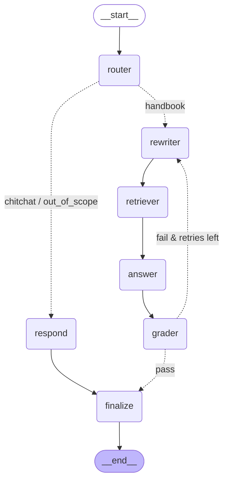

# Employee Handbook RAG Assistant

A production-grade Retrieval-Augmented Generation system over a company employee
handbook (PDF), built in phases: ingestion → hybrid retrieval → a LangGraph
multi-agent assistant → observability → evaluation → API/UI/deployment.

> **Note:** this repo ships **no** handbook PDF or generated data. Point it at
> your own `Employee_Handbook_2026.pdf` (or any handbook PDF). The document-
> specific page map in `ingestion/config.py` and the example questions in
> `evaluation/dataset.py` are illustrative samples — adapt them to your document.

## Use it with your own documents (PDF, Markdown, HTML, Confluence)

The fastest way to run this on **your** content — no handbook-specific config
needed. The generic ingester (`ingestion/generic.py`) accepts a single file or a
whole directory and supports **PDF, plain text, Markdown, HTML, and Confluence
exports**, producing the same chunk schema the rest of the system expects.

```bash
# A whole folder of mixed docs (recurses; --reset clears the collection first):
python -m ingestion.generic ./my_docs --reset

# A single file (type auto-detected by extension):
python -m ingestion.generic handbook.pdf
python -m ingestion.generic team_wiki.md
python -m ingestion.generic confluence_export.html --source-type confluence

# Preview chunks without embedding:
python -m ingestion.generic ./my_docs --dry-run
```

Then query it with everything else unchanged — retrieval, the agent CLI, the MCP
tool, the API, and the UI:

```bash
python -m retrieval.search "your question here" --k 5

# For your OWN documents, use a real LLM provider (it routes/answers generically):
LLM_PROVIDER=ollama python -m agents.chat --provider ollama --model llama3.2:3b
#   ...or anthropic / openai with the matching API key in .env
```

> The offline `--provider fake` router is keyword-tuned to the bundled *sample*
> handbook's vocabulary (leave, probation, POSH, …), so it's best for this repo's
> tests/demos. For arbitrary documents, use a real provider (Ollama needs no key).
> Retrieval itself is fully generic regardless of provider.

| Source | Extensions | How it's split |
|--------|-----------|----------------|
| PDF | `.pdf` | Per page (keeps page numbers in citations) |
| Markdown | `.md`, `.markdown` | On `#`–`######` headings (heading → section title) |
| HTML / Confluence | `.html`, `.htm`, `.xml` | On `<h1>`–`<h4>` (scripts/styles stripped) |
| Plain text | `.txt` | Whole file, recursively size-split |

**Confluence:** open a page or space → **Export to HTML** (or PDF) and point the
ingester at the export. For live pages, fetch them (e.g. via an Atlassian
integration) and save as `.html`. Tune chunking with `--chunk-size` /
`--chunk-overlap`, and pick a collection with `--collection <name>` (set the same
`COLLECTION_NAME` in `.env` so retrieval reads from it).

## Phase 1 — Ingestion (structured, handbook-specific)

Phase 1 of the RAG project: turn `Employee_Handbook_2026.pdf` into clean,
heading-aware, page-attributed chunks and load them into a local ChromaDB
vector store. Phase 2 (retrieval) will read from that store.

> For the full system architecture and a breakdown of every technology used
> (LangGraph, LangChain, ChromaDB, Ollama, RAGAS, FastAPI, Langfuse, …), see
> [`ARCHITECTURE.md`](ARCHITECTURE.md). For an interview-ready, code-backed
> walkthrough + Q&A bank, see [`STUDY-GUIDE.md`](STUDY-GUIDE.md).

## Quick start

```bash
cd handbook-rag-assistant
python3.12 -m venv .venv          # ChromaDB needs Python 3.11–3.13, NOT 3.14
source .venv/bin/activate
pip install -r requirements.txt

# Parse + chunk only — writes chunks.json + prints a validation report:
python -m ingestion.ingest Employee_Handbook_2026.pdf --dry-run

# Full run — also embeds and upserts into ChromaDB (downloads the local model once):
python -m ingestion.ingest Employee_Handbook_2026.pdf
```

## Code structure

```
ingestion/
  config.py      All document-specific facts (page roles, the 11 top-level
                 section names, front-matter titles, acronyms, soft cap...).
  extract.py     PyMuPDF text extraction (per page) + table->markdown fallback.
  clean.py       Boilerplate stripping, conservative regex de-gluing,
                 unicode/whitespace normalization, smart title-casing.
  chunk.py       Heading-aware chunker: front matter, per-subsection splitting,
                 section overviews, oversized-section paragraph splitting,
                 leave-table injection, deterministic ids, stats + TOC parsing.
  embeddings.py  Embedding-function factory (local default; OpenAI via .env).
  store.py       ChromaDB persistent cosine collection + deterministic upsert.
  ingest.py      CLI entry point (python -m ingestion.ingest) + report.
tests/
  test_ingestion.py  Unit tests for cleaning regexes and the heading splitter
                     (small inline fixtures, no PDF needed).
```

## How the document is handled

| Pages | Handling |
|-------|----------|
| 1, 2-3, 47 | Skipped (cover, TOC, contact). TOC is still parsed for validation. |
| 4-9 | One whole-page chunk each, hand-titled, section `0.1`–`0.6`, parent `Front Matter`. Page 9 (Revision History) is rendered from `find_tables()` as markdown. |
| 10-46 | Split on `N.M.` subsection headings — one chunk per subsection. Embedded top-level headings (e.g. `7. DISCIPLINE POLICY`) are stripped from bodies. The page-24 leave entitlement table is injected as markdown into the section-5 chunk. |

Each chunk stores: `section_number`, `section_title`, `parent_section`,
`pages`, `source`, `part`/`total_parts`, the clean `body` (display text), and
`embedding_text` (`"Leave Policies > 5.1 Earned Leave (EL):\n<body>"`) — the
latter is what gets embedded. Ids are `source-section-part-<hash>` so
re-ingestion **upserts** instead of duplicating.

## A note on extraction order (`sort`)

The PDF is a 2–3 column layout. The content stream is already in natural
reading order, so the default `get_text("text", sort=False)` produces clean,
coherent bodies with headings on their own lines (~92 chunks). `sort=True`
sorts text blocks by vertical position and **interleaves the columns** into
incoherent bodies, so it is not the default here. Pass `--sort` to force the
legacy sorted behaviour for comparison.

## Swapping the embedding model

Defaults to a local `all-MiniLM-L6-v2` model (no API key). To use OpenAI,
copy `.env.example` to `.env` and set `EMBEDDING_PROVIDER=openai` +
`OPENAI_API_KEY`. The provider lives behind `embeddings.get_embedding_function()`.

## Tests

```bash
python -m pytest -q           # or: python -m unittest discover -s tests
```

---

# Phase 2 — Retrieval layer (`retrieval/`)

A hybrid retriever that, given a question, returns the most relevant handbook
sections with a full score breakdown.

```bash
python -m retrieval.search "how many earned leaves do I get?" --k 5 --debug
```

(First run downloads the cross-encoder model, ~80MB.)

## Pipeline

```
            ┌─ vector search (cosine, top 20) ─┐
query ──────┤                                  ├─ RRF fuse ─ rerank (top_k) ─ post-process ─ results
            └─ BM25 search  (top 20) ──────────┘
```

1. **Vector search** (`vector.py`) — embeds the query with the *same* model
   Phase 1 used and finds nearest chunks by cosine similarity.
2. **BM25 keyword search** (`bm25.py`) — a `rank_bm25` index built over the same
   chunks (loaded from ChromaDB, the single source of truth). Catches verbatim
   terms embeddings miss (`LOP`, `EL`, `comp-off`, `POSH`, `ESS`, `AcmeApp`).
   A small query **synonym map** expands e.g. `WFH → work from home teleworking`.
3. **Fusion** (`fusion.py`) — Reciprocal Rank Fusion (k=60) merges the two lists
   by rank, sidestepping the incompatible score scales.
4. **Reranker** (`rerank.py`) — `cross-encoder/ms-marco-MiniLM-L-6-v2` rescores
   the fused top-20 against `section_title + display_text`; keeps top_k. Toggle
   with `USE_RERANKER`.
5. **Post-processing** (`postprocess.py`), after reranking:
   - *Cross-reference expansion* — pulls in sections the text points to
     (`"see Section 5.11"`), flagged `expanded_from:X`.
   - *Multi-part stitching* — fetches sibling parts of split sections (5.13,
     10.11, 10.13), flagged `stitched:X`.
   - *Sibling hints* — annotates each result with the other sections under its
     parent, so the answer layer can mention related policies.
6. **Result** (`types.py`) — a typed `RetrievalResult` with display text,
   section metadata, `pages` parsed back to ints, all four scores, and a ready
   citation like `[5.2 Sick Leave (SL), p.25]`.

`Retriever` (`retriever.py`) composes the above; `VectorSearch`/`BM25Search`
share one `Searcher` interface (`base.py`).

## Configuration (`config.py`, pydantic-settings)

All read from `.env` (see `.env.example`); every knob is defaulted:

| Setting | Default | Meaning |
|---------|---------|---------|
| `TOP_K` | 5 | final results returned |
| `FETCH_K` | 20 | fused candidates sent to the reranker |
| `VECTOR_N` / `BM25_N` | 20 / 20 | per-searcher top-N |
| `RRF_K` | 60 | RRF constant |
| `USE_RERANKER` | true | enable the cross-encoder |
| `RERANKER_MODEL` | ms-marco-MiniLM-L-6-v2 | cross-encoder model |
| `USE_EXPANSION` | true | cross-reference expansion |
| `USE_STITCHING` | true | multi-part stitching |

CLI flags `--no-rerank`, `--no-expansion`, `--no-stitching` override per run.

## Tests

`tests/test_retrieval.py` has fast pure-function tests plus handbook-specific
**integration tests** that require the populated ChromaDB (they auto-skip if the
collection is missing). Run Phase 1 first, then:

```bash
python -m pytest tests/test_retrieval.py -q
```

---

# Phase 3 — Multi-agent system (`agents/`)

A [LangGraph](https://langchain-ai.github.io/langgraph/) `StateGraph` that turns
the Phase 2 retriever into a conversational HR assistant with routing, query
rewriting, a grounded-answer **retry loop**, and per-thread memory. Every agent
decision is a **Pydantic structured output** (no string parsing), and answers
are grounded *only* in retrieved excerpts — the assistant refuses rather than
guessing on HR policy.

```bash
# Real model (recommended): set a provider + key in .env first
LLM_PROVIDER=anthropic   # + ANTHROPIC_API_KEY=...   (or openai + OPENAI_API_KEY)
python -m agents.chat --thread demo1

# Fully local, no key: run Ollama, then
#   ollama serve && ollama pull llama3.1
LLM_PROVIDER=ollama OLLAMA_MODEL=llama3.1 python -m agents.chat --provider ollama

# No API key? Run the deterministic offline model (retrieval is still real):
python -m agents.chat --provider fake --thread demo1
python -m agents.chat --provider fake --thread demo1 --once "how much earned leave do I get?"
```

Each turn prints a trace of which nodes fired and the route taken:

```
trace: router(handbook)->rewriter->retriever(2 queries)->answer->grader(pass)->finalize
```

## The graph



(Regenerate with `HandbookAgent().mermaid()`, which calls
`graph.get_graph().draw_mermaid()`.)

## Nodes

| Node | LLM? | Purpose |
|------|------|---------|
| **router** | yes | Classify the latest turn → `handbook` / `chitchat` / `out_of_scope` (uses history to resolve follow-ups). |
| **respond** | yes | Answer chitchat warmly / explain scope for out-of-scope (suggests `hr@example.com`). No retrieval. |
| **rewriter** | yes | Resolve coreferences, map casual→handbook vocabulary, decompose multi-part questions (≤3 sub-queries). On retry, produces a *different* formulation guided by the grader. |
| **retriever** | **no** | Pure tool node: runs Phase 2 retrieval per sub-query, dedupes by `chunk_id`, orders by best rerank score. |
| **answer** | yes | Drafts an answer grounded only in the excerpts, with inline citations and verbatim numbers/units. |
| **grader** | yes | Structured `{grounded, complete, reasoning}`. Pass → finalize; fail → rewriter (≤`MAX_RETRIES`); exhausted → honest fallback. |
| **finalize** | no | Emits the final answer and appends it to history. Exhausted retries → "couldn't fully answer" + closest sections + HR contact (never a forced answer). |

## Memory: two related queries in one thread

The SQLite checkpointer keys conversation state by `thread_id`, so follow-ups
resolve against history. Run both in the **same thread**:

```bash
python -m agents.chat --provider fake --thread leave-chat --once "what is maternity leave duration"
python -m agents.chat --provider fake --thread leave-chat --once "and for adoption?"
```

The router sees the second message is a follow-up (→ `handbook`), and the
rewriter rewrites *"and for adoption?"* → *"what is adoption leave duration"*,
so the answer is about Adoption Leave (12 weeks, §5.5) — no need to restate the
topic. (Interactively, just type the two lines in one `agents.chat` session.)

## Configuration (`agents/config.py`)

`LLM_PROVIDER` (`anthropic`/`openai`/`ollama`/`fake`), `ANTHROPIC_MODEL`/`OPENAI_MODEL`,
`OLLAMA_MODEL`/`OLLAMA_BASE_URL`, `TEMPERATURE` (0), `MAX_RETRIES` (2),
`MAX_CONTEXT_CHUNKS` (10), `CHECKPOINT_DB`.
See `.env.example`.

> **About `fake`:** a deterministic, rule-based stand-in (not an LLM) that
> implements the same interface so the graph/routing/memory/no-fabrication
> behavior runs offline and in CI. It composes answers from the *real* retrieved
> excerpts (numbers it quotes are genuinely from the handbook). Use a real
> provider for fluent answers.

## Tests

```bash
python -m unittest tests.test_agents -v        # offline by default (provider=fake)
AGENT_TEST_PROVIDER=anthropic python -m unittest tests.test_agents -v   # against a real model
```

Covers: chitchat routes with no retrieval call (spied), out-of-scope routing,
earned-leave amount + citation (`15`, §5.1), probation notice units
(`30 calendar days`, not business), multi-part answers citing ≥2 sections,
follow-up memory (adoption resolved from prior maternity turn), and
no-fabrication for an absent policy ("office pets").

---

# Using it directly from the Cursor agent (MCP)

`mcp_server.py` exposes the **retriever** as an MCP tool (`search_handbook`) so
you can ask handbook questions in any Cursor chat — the Cursor model calls the
tool and answers with citations. No LLM API key is needed (Cursor's model is the
LLM); retrieval runs locally against ChromaDB.

Registered in `~/.cursor/mcp.json`:

```json
"employee-handbook": {
  "command": "/abs/path/to/handbook-rag-assistant/.venv/bin/python",
  "args": ["-m", "mcp_server"],
  "env": { "PYTHONPATH": "/abs/path/to/handbook-rag-assistant" }
}
```

After editing `mcp.json`, reload MCP servers (Cursor Settings → MCP, or restart
Cursor). Then just ask, e.g. *"How much earned leave do I get?"* — the agent
calls `search_handbook` and replies *"15 days … [5.1 Earned Leave (EL), p.24]"*.
A workspace rule (`.cursor/rules/employee-handbook.mdc`) tells the agent to use
the tool and follow the grounding rules (cite, exact units, refuse if absent).

`search_handbook(query, k=5)` returns ranked excerpts — each with `citation`,
section metadata, `text`, `rerank_score`, `origin`, and `related_sections` —
plus `grounding_rules` the agent must follow.

# Phase 5 — Evaluation (`evaluation/`)

A golden dataset, RAGAS metrics, a custom LLM-free metric, a chunking A/B
experiment, and a regression guard.

```bash
python -m evaluation.build_dataset            # write the golden set (+ synthetic for review)
python -m evaluation.run --target retrieval   # context_precision/recall + section_hit_rate
python -m evaluation.run --target rag          # faithfulness/answer_relevancy/answer_correctness
python -m evaluation.run --target retrieval --check   # CI regression guard (exit 1 on >5% drop)
python -m evaluation.compare_chunking          # Strategy A (section-aware) vs B (recursive)
```

## Dataset (`dataset.jsonl`)

Each item is `{question, ground_truth, ground_truth_sections}`. The
`CORE_DATASET` in `dataset.py` ships **illustrative sample** items (replace them
with answers hand-verified against your own handbook) — an LLM never rewrites
them. `build_dataset` also runs RAGAS
`TestsetGenerator` over the ingested chunks and writes ~13 synthetic questions
to `dataset_synthetic_unreviewed.jsonl` for **manual** promotion (a wrong
synthetic ground truth silently poisons every future eval, so it is never
auto-merged). Synthetic generation needs an evaluator LLM key; without one it is
skipped with a clear message.

## Metrics

- **`section_hit_rate`** (custom, no LLM): fraction of questions where
  `ground_truth_sections ⊆ retrieved section_numbers`. The most interpretable
  number in the project — it runs offline with zero API keys.
- **Retrieval** (RAGAS, needs judge): `context_precision`, `context_recall`.
- **Full pipeline** (RAGAS, needs judge): `faithfulness`, `answer_relevancy`,
  `answer_correctness`.

The evaluator LLM follows the same `.env` provider pattern as Phase 3; RAGAS
uses **local** HF embeddings so it never makes paid embedding calls. Judge calls
are cached by `(question, answer, contexts, reference, metric, model)` hash
(`.judge_cache.json`) so re-running after a retrieval-only change is cheap.
Every aggregate is pushed to Langfuse on a trace tagged `eval` with a
timestamp+git `run_id`, and written to `results/<run_id>.json` (per-question
scores, aggregates, and the 3 worst questions per metric).

## Regression guard

`baseline.json` stores current aggregates. `run --check` re-evaluates and exits
nonzero if any aggregate drops more than 5% (configurable) below the baseline —
wire it into CI. `run --update-baseline` saves the current run as the new bar.

## Chunking experiment (`compare_chunking`)

Tests Phase 1's bet that heading-aware chunking beats naive splitting. Strategy
B re-uses Phase 1's extraction + cleaning but splits with
`RecursiveCharacterTextSplitter` (1000 tokens, 150 overlap) into a separate
`recursive_baseline` collection (page metadata only), then runs the
same retriever config on both. Because B has no sections, ground-truth sections
are mapped to pages (via A's metadata) for an apples-to-apples `page_hit_rate`.
Output: `results/chunking_comparison.md` (metrics side by side + real retrieved
text for two probe questions). The current result is decisive:

| Metric | Strategy A (section-aware) | Strategy B (recursive) |
|---|---|---|
| `page_hit_rate` (gt pages ⊆ retrieved) | **1.000** | 0.583 |
| `page_overlap_rate` (gt pages ∩ retrieved) | 1.000 | 1.000 |

B lands "in the right neighbourhood" (overlap 1.0) but fails to surface the
*full* set of answer pages: its 1000-token chunks swallow the `5. LEAVE
POLICIES` header plus several short leave subsections, so a "sick leave" query
retrieves a generic leave-policy blob (and even Maternity Leave) instead of the
clean `5.2 Sick Leave` section that A returns.

## Tests

```bash
python -m unittest tests.test_evaluation
```

Covers dataset-schema validation, `section_hit_rate` on a fixture, and that
`run --check` exits nonzero against a doctored baseline.

# Phase 6 — API + UI + deployment (`api/`, `ui/`)

A FastAPI backend that serves the Phase 3 agent over a streaming SSE endpoint,
and a Streamlit chat UI that talks only to the API. Full deployment guide
(local + Docker, volumes, one-off ingestion, log tailing) is in
[`README-DEPLOY.md`](README-DEPLOY.md).

## Run it (local, no Docker)

```bash
uvicorn api.main:app --port 8000          # terminal 1: loads retriever ONCE
API_BASE_URL=http://localhost:8000 \
  streamlit run ui/app.py                  # terminal 2: opens :8501
```

Works with zero keys (the API auto-falls back to the offline `fake` provider);
set `LLM_PROVIDER` + a key in `.env` for real answers, and `LANGFUSE_*` for
tracing + feedback scoring.

## Backend (`api/`)

- **Lifespan startup** loads the retriever, BM25 index, cross-encoder, and the
  compiled LangGraph **once** — never per request. The checkpointer is
  `AsyncSqliteSaver`, so the stack is async end to end.
- **`POST /ask`** streams Server-Sent Events as the agents work:
  `status` (router/rewriter/retriever/grader activity) → `token` (answer) →
  `citations` → `trace` (node_path, grader verdict, retry_count, Langfuse
  trace_id) → `done` (thread_id). A null `thread_id` is generated and returned
  so the client can continue the conversation. Rate-limited to 10/min/IP
  (slowapi); mid-stream errors emit `{"type":"error",…}` and close cleanly.
- **`POST /feedback`** pushes a `user_feedback` score (±1) to Langfuse.
- **`GET /health`** reports ChromaDB / BM25 / LLM-key / Langfuse status (503 if
  a critical component is down).
- **`GET /sections`** lists section numbers + titles (UI index);
  **`GET /threads/{id}`** exposes checkpointer state (proves memory).

## UI (`ui/`)

Single-page `st.chat_input` app: live "Agent activity" line from status events,
tokens streamed into the bubble, a **Sources** expander (section, pages,
snippet), a **How this answer was made** expander (node path, retries, grader),
👍/👎 feedback wired to `/feedback`, and a sidebar with **New conversation**, a
clickable handbook index from `/sections`, and the HR disclaimer. Thread id
lives in `st.session_state`, so follow-ups ("and what about adoption leave?")
resolve against the previous turn. Graceful message if the API is down.

## Tests

```bash
python -m unittest tests.test_api
```

`/health` up, empty question → 422, the `/ask` SSE happy path (status → token →
citations → done order), two same-thread calls sharing checkpointer state, and
`/feedback` calling the (mocked) Langfuse client.

---

## License

Released under the [MIT License](LICENSE). You are free to use, modify, and
distribute it. Bring your own documents — no data is included in this repo.
